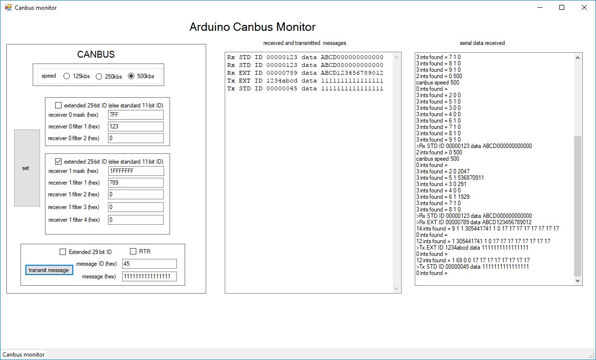

# Arduino_Canbus_Monitor
a C# program which uses an arduino+canbus shield to Monitor Canbus traffic
# Arduino_Canbus_Monitor
a C# program which uses an arduino+canbus shield to Monitor Canbus traffic

hardware
1.  Arduino Uno, Mega or similar
2.  Seeed CAN-BUS Shield V1.2 

programming:
1. program the Arduino using the file Arduino_Canbus_Monitor/ArduinoCanbusMonitor/ArduinoCanbusCode/ArduinoCanbusCode.ino
2.  Instal Vistal Studio 2017 or later
3.  open VS project Arduino_Canbus_Monitor/ArduinoCanbusMonitor/CS_code/ArduinoCanbusMonitor.sln
4.  hit CTRL/F5 to compile, build and run 



note that this code requires an updated version of the following function 
```
/*********************************************************************************************************
** Function name:           mcp2515_read_canMsg
** Descriptions:            read message
*********************************************************************************************************/
void MCP_CAN::mcp2515_read_canMsg( const byte buffer_load_addr, volatile unsigned long *id, volatile byte *ext, volatile byte *rtrBit, volatile byte *len, volatile byte *buf)        /* read can msg                 */
{
  byte tbufdata[4];
  byte i;

  MCP2515_SELECT();
  spi_readwrite(buffer_load_addr);
  // mcp2515 has auto-increment of address-pointer
  for (i = 0; i < 4; i++) tbufdata[i] = spi_read();

  *rtrBit=(tbufdata[3]&0x08 ? 1 : 0 );            // <<<  does not work 23/1/2018

  *id = (tbufdata[MCP_SIDH] << 3) + (tbufdata[MCP_SIDL] >> 5);
   *ext=0;                                           // <<<   zero EXT bit  23/1/2013
  if ( (tbufdata[MCP_SIDL] & MCP_TXB_EXIDE_M) ==  MCP_TXB_EXIDE_M )
  {
    /* extended id                  */
    *id = (*id << 2) + (tbufdata[MCP_SIDL] & 0x03);
    *id = (*id << 8) + tbufdata[MCP_EID8];
    *id = (*id << 8) + tbufdata[MCP_EID0];
    *ext = 1;
  }

 // *len=spi_read() & MCP_DLC_MASK;             // <<< replaced with following statements
   byte pMsgSize=spi_read();                    // <<< read Data Length 23/1/2018
  *len=pMsgSize & MCP_DLC_MASK;                // <<< message length 23/1/2018
  *rtrBit=(pMsgSize & MCP_RTR_MASK ? 1 : 0 );  // <<  get RTR bit  23/1/2018
 for (i = 0; i < *len && i<CAN_MAX_CHAR_IN_MESSAGE; i++) {
    buf[i] = spi_read();
  }

  MCP2515_UNSELECT();
}
```
